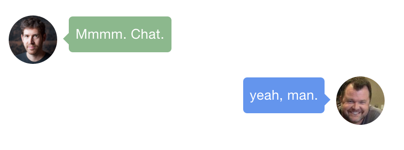

# gitbook-plugin-chatlog

Easily format a chat exchange in your book.

```



Mmmm. Chat.



yeah, man.



```



## Installation

First, add this plugin to your `book.json`:

```json
{
  "plugins": ["chatquote"]
}
```

Then install the plugin locally:

```shell
$ gitbook install
```

## Configuration

Styles for each chat participant are defined within `pluginsConfig`.

```json
{
  "plugins": ["chatquote"],
  "pluginsConfig": {
    "chatlog": {
      "users": {
        "claylo": {
          "balloon": "#08f",
          "text": "#fff"
        },
        "mojombo": {
          "balloon": "#ddd",
          "text": "#000"
        }
      }
    }
  }
}
```

Any username can be used as the key, so long as it is defined within the plugin configuration.

